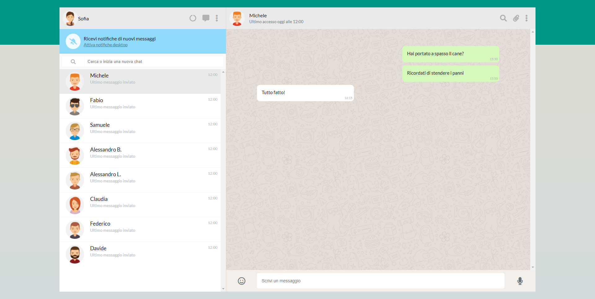

* Descrizione

Consultare il brief di progetto inviato
In questo documento sono indicate le specifiche tecniche della web app che dovrete realizzare.
L'applicazione dovrá avere le funzionalitá richieste nella brief
Il cliente si aspetta che voi realizziate quanto pattuito, quindi leggete la brief ed eseguite quanto richiesto nell'ordine stabilito dalle milestone.

## Milestone 1
● Replica della grafica con la possibilità di avere messaggi scritti dall’utente (verdi) e dall’interlocutore (bianco) assegnando due classi CSS diverse

● Visualizzazione dinamica della lista contatti: tramite la direttiva v-for, visualizzare nome e immagine di ogni contatto
